# Project: Analysis of Brazil's medical appointment dataset

## Table of Contents
<ul>
<li><a href="#intro">Introduction</a></li>
<li><a href="#data_details">Dataset Details</a></li>
<li><a href="#wrangling">Data Wrangling</a></li>
<li><a href="#eda">Exploratory Data Analysis</a></li>
<li><a href="#conclusions">Conclusions</a></li>
</ul>

## Introduction <a id='intro'></a>


The purpose of this document is to analyze a medical appointment dataset. This dataset consists of information from 100k medical appointments in Brazil, mainly focusing on whether or not patients show up for their appointment.

#### The following questions will be explored :
 1. What factors are important for us to know in order to predict if a patient will show up for their scheduled appointment?
 2. What is the proportion of men & women who register for medical appointments?
 3. Which neighbourhoods report the most medical problems?
 4. Is aging correlated to medical problems such as hypertension, diabetes, etc.?

<a id='data_details'></a>
## Dataset Details

 **Link :** https://www.kaggle.com/joniarroba/noshowappointments

 **Characteristics :**

 - **PatientId** : Identification of a patient 
 - **AppointmentID** : Identification of each appointment 
 - **Gender** : Male or Female
 - **ScheduledDay** : On what day the patient set up their appointment (will always be before or on the appointment day)
 - **AppointmentDay** : The actual appointment date
 - **Age** : How old is the patient.
 - **Neighbourhood** : Location of the hospital
 - **Scholarship** : indicates whether or not the patient is enrolled in Brasilian welfare program Bolsa Família.
 - **Hipertension** : 1 for True and 0 for False 
 - **Diabetes** : True or False
 - **Alcoholism** : True or False
 - **Handcap** : True or False
 - **SMS_received** : 1 or more messages sent to the patient.
 - **No-show** : 'No' means patient showed up, and 'Yes' means they didn't show up

## Import Statements


```python
%matplotlib inline

import numpy as np
import pandas as pd
import matplotlib.pyplot as plt
import seaborn as sns

# Customization of the seaborn graphs
sns.set(style="whitegrid", color_codes=True)
```

<a id='wrangling'></a>
## Data Wrangling

### Loading CSV Data and initial cleaning

**Note :** During loading itself, we are cleaning up the following aspects of the data : 

1. Data types of the ID columns are set to string (e.g. 'PatientId' and 'AppointmentID' should be of type string)
2. Columns containing dates are parsed
3. Boolean fields are converted to bool type from the string values


```python
def string_to_bool(value):
    '''Type converter for columns to map the value of '1' to boolean True'''
    return value == '1' 

def no_show_to_bool(value):
    '''Type converter for columns to map the value of 'Yes' to boolean True'''
    return value == 'Yes'

def sms_received_to_bool(value):
    '''Type converter for determing whether one or more SMS has been received by the patient'''
    return int(value) > 0

appointment_data = pd.read_csv('noshowappointments-kagglev2-may-2016.csv', 
                               dtype={'PatientId': str, 'AppointmentID' : str},
                               parse_dates = ['ScheduledDay', 'AppointmentDay'],
                               converters = {'Scholarship': string_to_bool,
                                             'Hipertension': string_to_bool,
                                             'Diabetes': string_to_bool,
                                             'Alcoholism': string_to_bool,
                                             'Handcap': string_to_bool,
                                             'SMS_received': sms_received_to_bool,
                                             'No-show' : no_show_to_bool},
                               encoding = "utf8"
                              )

# Check the data types (whether loaded correctly or not)
appointment_data.dtypes
```


    PatientId                 object
    AppointmentID             object
    Gender                    object
    ScheduledDay      datetime64[ns]
    AppointmentDay    datetime64[ns]
    Age                        int64
    Neighbourhood             object
    Scholarship                 bool
    Hipertension                bool
    Diabetes                    bool
    Alcoholism                  bool
    Handcap                     bool
    SMS_received                bool
    No-show                     bool
    dtype: object


**Initial Sample data (first 5 rows)**


```python
appointment_data.head(5)
```


<div>
<table border="1" class="dataframe">
  <thead>
    <tr style="text-align: right;">
      <th></th>
      <th>PatientId</th>
      <th>AppointmentID</th>
      <th>Gender</th>
      <th>ScheduledDay</th>
      <th>AppointmentDay</th>
      <th>Age</th>
      <th>Neighbourhood</th>
      <th>Scholarship</th>
      <th>Hipertension</th>
      <th>Diabetes</th>
      <th>Alcoholism</th>
      <th>Handcap</th>
      <th>SMS_received</th>
      <th>No-show</th>
    </tr>
  </thead>
  <tbody>
    <tr>
      <th>0</th>
      <td>29872499824296</td>
      <td>5642903</td>
      <td>F</td>
      <td>2016-04-29 18:38:08</td>
      <td>2016-04-29</td>
      <td>62</td>
      <td>JARDIM DA PENHA</td>
      <td>False</td>
      <td>True</td>
      <td>False</td>
      <td>False</td>
      <td>False</td>
      <td>False</td>
      <td>False</td>
    </tr>
    <tr>
      <th>1</th>
      <td>558997776694438</td>
      <td>5642503</td>
      <td>M</td>
      <td>2016-04-29 16:08:27</td>
      <td>2016-04-29</td>
      <td>56</td>
      <td>JARDIM DA PENHA</td>
      <td>False</td>
      <td>False</td>
      <td>False</td>
      <td>False</td>
      <td>False</td>
      <td>False</td>
      <td>False</td>
    </tr>
    <tr>
      <th>2</th>
      <td>4262962299951</td>
      <td>5642549</td>
      <td>F</td>
      <td>2016-04-29 16:19:04</td>
      <td>2016-04-29</td>
      <td>62</td>
      <td>MATA DA PRAIA</td>
      <td>False</td>
      <td>False</td>
      <td>False</td>
      <td>False</td>
      <td>False</td>
      <td>False</td>
      <td>False</td>
    </tr>
    <tr>
      <th>3</th>
      <td>867951213174</td>
      <td>5642828</td>
      <td>F</td>
      <td>2016-04-29 17:29:31</td>
      <td>2016-04-29</td>
      <td>8</td>
      <td>PONTAL DE CAMBURI</td>
      <td>False</td>
      <td>False</td>
      <td>False</td>
      <td>False</td>
      <td>False</td>
      <td>False</td>
      <td>False</td>
    </tr>
    <tr>
      <th>4</th>
      <td>8841186448183</td>
      <td>5642494</td>
      <td>F</td>
      <td>2016-04-29 16:07:23</td>
      <td>2016-04-29</td>
      <td>56</td>
      <td>JARDIM DA PENHA</td>
      <td>False</td>
      <td>True</td>
      <td>True</td>
      <td>False</td>
      <td>False</td>
      <td>False</td>
      <td>False</td>
    </tr>
  </tbody>
</table>
</div>


**Check for null values (i.e. NaN) :** There are no null values in the dataset as analyzed below : 


```python
appointment_data.isnull().any()
```


    PatientId         False
    AppointmentID     False
    Gender            False
    ScheduledDay      False
    AppointmentDay    False
    Age               False
    Neighbourhood     False
    Scholarship       False
    Hipertension      False
    Diabetes          False
    Alcoholism        False
    Handcap           False
    SMS_received      False
    No-show           False
    dtype: bool


### Further cleaning

There are still some problems remaining in the dataset that need to be cleaned : 

1. The columnns that have a typo in their names need to be renamed
2. The column 'Age' has erroneous values (negative age) and such rows need to be deleted
3. Additional derived columns need to be added for further analysis
4. Records having negative Gap Days (i.e. Appointment Date is before the Scheduled Date) need to be removed

The details are as follows : 

**1. Rename columns having typos**


```python
appointment_data.rename(columns={'PatientId':'PatientID', 'Hipertension':'Hypertension','Handcap':'Handicap'}, inplace = True)
```

**2. Remove row(s) having negative age**


```python
print 'Initial row count : ', len(appointment_data.index)
appointment_data = appointment_data[appointment_data['Age'] >= 0]
print 'Final row count after cleaning negative age records : ', len(appointment_data.index)
```

    Initial row count :  110527
    Final row count after cleaning negative age records :  110526
    

**3. Add additional derived columns**

1. GapDays : This column (int64) denotes the interval (in days) between between the appointment day and the scheduled day.
2. MedicalCondition : This column (boolean) denotes whether or not the patient suffers from one of the four medical conditions - Hypertension, Diabetes, Alcoholism, or Handicap.


```python
appointment_data['GapDays'] = (appointment_data['AppointmentDay'].dt.date - appointment_data['ScheduledDay'].dt.date).dt.days
appointment_data['MedicalCondition'] = appointment_data['Hypertension'] | appointment_data['Diabetes'] | appointment_data['Alcoholism'] | appointment_data['Handicap']
```

**4. Remove erroroneous 'GapDays' records**

Appointment date cannot be before the schedule date. Hence, these records are removed.

The following are the erroneous records : 


```python
appointment_data[appointment_data['GapDays'] < 0]
```


<div>
<table border="1" class="dataframe">
  <thead>
    <tr style="text-align: right;">
      <th></th>
      <th>PatientID</th>
      <th>AppointmentID</th>
      <th>Gender</th>
      <th>ScheduledDay</th>
      <th>AppointmentDay</th>
      <th>Age</th>
      <th>Neighbourhood</th>
      <th>Scholarship</th>
      <th>Hypertension</th>
      <th>Diabetes</th>
      <th>Alcoholism</th>
      <th>Handicap</th>
      <th>SMS_received</th>
      <th>No-show</th>
      <th>GapDays</th>
      <th>MedicalCondition</th>
    </tr>
  </thead>
  <tbody>
    <tr>
      <th>27033</th>
      <td>7839272661752</td>
      <td>5679978</td>
      <td>M</td>
      <td>2016-05-10 10:51:53</td>
      <td>2016-05-09</td>
      <td>38</td>
      <td>RESISTÊNCIA</td>
      <td>False</td>
      <td>False</td>
      <td>False</td>
      <td>False</td>
      <td>True</td>
      <td>False</td>
      <td>True</td>
      <td>-1</td>
      <td>True</td>
    </tr>
    <tr>
      <th>55226</th>
      <td>7896293967868</td>
      <td>5715660</td>
      <td>F</td>
      <td>2016-05-18 14:50:41</td>
      <td>2016-05-17</td>
      <td>19</td>
      <td>SANTO ANTÔNIO</td>
      <td>False</td>
      <td>False</td>
      <td>False</td>
      <td>False</td>
      <td>True</td>
      <td>False</td>
      <td>True</td>
      <td>-1</td>
      <td>True</td>
    </tr>
    <tr>
      <th>64175</th>
      <td>24252258389979</td>
      <td>5664962</td>
      <td>F</td>
      <td>2016-05-05 13:43:58</td>
      <td>2016-05-04</td>
      <td>22</td>
      <td>CONSOLAÇÃO</td>
      <td>False</td>
      <td>False</td>
      <td>False</td>
      <td>False</td>
      <td>False</td>
      <td>False</td>
      <td>True</td>
      <td>-1</td>
      <td>False</td>
    </tr>
    <tr>
      <th>71533</th>
      <td>998231581612122</td>
      <td>5686628</td>
      <td>F</td>
      <td>2016-05-11 13:49:20</td>
      <td>2016-05-05</td>
      <td>81</td>
      <td>SANTO ANTÔNIO</td>
      <td>False</td>
      <td>False</td>
      <td>False</td>
      <td>False</td>
      <td>False</td>
      <td>False</td>
      <td>True</td>
      <td>-6</td>
      <td>False</td>
    </tr>
    <tr>
      <th>72362</th>
      <td>3787481966821</td>
      <td>5655637</td>
      <td>M</td>
      <td>2016-05-04 06:50:57</td>
      <td>2016-05-03</td>
      <td>7</td>
      <td>TABUAZEIRO</td>
      <td>False</td>
      <td>False</td>
      <td>False</td>
      <td>False</td>
      <td>False</td>
      <td>False</td>
      <td>True</td>
      <td>-1</td>
      <td>False</td>
    </tr>
  </tbody>
</table>
</div>


```python
# Remove the erroneous records
appointment_data = appointment_data[appointment_data['GapDays'] >= 0]
```

**Final sample data after cleaning (first 6 rows)**


```python
print appointment_data.dtypes
appointment_data.head(6)
```

    PatientID                   object
    AppointmentID               object
    Gender                      object
    ScheduledDay        datetime64[ns]
    AppointmentDay      datetime64[ns]
    Age                          int64
    Neighbourhood               object
    Scholarship                   bool
    Hypertension                  bool
    Diabetes                      bool
    Alcoholism                    bool
    Handicap                      bool
    SMS_received                  bool
    No-show                       bool
    GapDays                      int64
    MedicalCondition              bool
    dtype: object
    


<div>
<table border="1" class="dataframe">
  <thead>
    <tr style="text-align: right;">
      <th></th>
      <th>PatientID</th>
      <th>AppointmentID</th>
      <th>Gender</th>
      <th>ScheduledDay</th>
      <th>AppointmentDay</th>
      <th>Age</th>
      <th>Neighbourhood</th>
      <th>Scholarship</th>
      <th>Hypertension</th>
      <th>Diabetes</th>
      <th>Alcoholism</th>
      <th>Handicap</th>
      <th>SMS_received</th>
      <th>No-show</th>
      <th>GapDays</th>
      <th>MedicalCondition</th>
    </tr>
  </thead>
  <tbody>
    <tr>
      <th>0</th>
      <td>29872499824296</td>
      <td>5642903</td>
      <td>F</td>
      <td>2016-04-29 18:38:08</td>
      <td>2016-04-29</td>
      <td>62</td>
      <td>JARDIM DA PENHA</td>
      <td>False</td>
      <td>True</td>
      <td>False</td>
      <td>False</td>
      <td>False</td>
      <td>False</td>
      <td>False</td>
      <td>0</td>
      <td>True</td>
    </tr>
    <tr>
      <th>1</th>
      <td>558997776694438</td>
      <td>5642503</td>
      <td>M</td>
      <td>2016-04-29 16:08:27</td>
      <td>2016-04-29</td>
      <td>56</td>
      <td>JARDIM DA PENHA</td>
      <td>False</td>
      <td>False</td>
      <td>False</td>
      <td>False</td>
      <td>False</td>
      <td>False</td>
      <td>False</td>
      <td>0</td>
      <td>False</td>
    </tr>
    <tr>
      <th>2</th>
      <td>4262962299951</td>
      <td>5642549</td>
      <td>F</td>
      <td>2016-04-29 16:19:04</td>
      <td>2016-04-29</td>
      <td>62</td>
      <td>MATA DA PRAIA</td>
      <td>False</td>
      <td>False</td>
      <td>False</td>
      <td>False</td>
      <td>False</td>
      <td>False</td>
      <td>False</td>
      <td>0</td>
      <td>False</td>
    </tr>
    <tr>
      <th>3</th>
      <td>867951213174</td>
      <td>5642828</td>
      <td>F</td>
      <td>2016-04-29 17:29:31</td>
      <td>2016-04-29</td>
      <td>8</td>
      <td>PONTAL DE CAMBURI</td>
      <td>False</td>
      <td>False</td>
      <td>False</td>
      <td>False</td>
      <td>False</td>
      <td>False</td>
      <td>False</td>
      <td>0</td>
      <td>False</td>
    </tr>
    <tr>
      <th>4</th>
      <td>8841186448183</td>
      <td>5642494</td>
      <td>F</td>
      <td>2016-04-29 16:07:23</td>
      <td>2016-04-29</td>
      <td>56</td>
      <td>JARDIM DA PENHA</td>
      <td>False</td>
      <td>True</td>
      <td>True</td>
      <td>False</td>
      <td>False</td>
      <td>False</td>
      <td>False</td>
      <td>0</td>
      <td>True</td>
    </tr>
    <tr>
      <th>5</th>
      <td>95985133231274</td>
      <td>5626772</td>
      <td>F</td>
      <td>2016-04-27 08:36:51</td>
      <td>2016-04-29</td>
      <td>76</td>
      <td>REPÚBLICA</td>
      <td>False</td>
      <td>True</td>
      <td>False</td>
      <td>False</td>
      <td>False</td>
      <td>False</td>
      <td>False</td>
      <td>2</td>
      <td>True</td>
    </tr>
  </tbody>
</table>
</div>


<a id='eda'></a>
## Exploratory Data Analysis

### Correlation Matrix


```python
correlation_matrix = appointment_data.corr()
sns.heatmap(correlation_matrix, 
            mask=np.zeros_like(correlation_matrix, dtype=np.bool), cmap=sns.diverging_palette(220, 10, as_cmap=True),
            square=True)
correlation_matrix
```


<div>
<table border="1" class="dataframe">
  <thead>
    <tr style="text-align: right;">
      <th></th>
      <th>Age</th>
      <th>Scholarship</th>
      <th>Hypertension</th>
      <th>Diabetes</th>
      <th>Alcoholism</th>
      <th>Handicap</th>
      <th>SMS_received</th>
      <th>No-show</th>
      <th>GapDays</th>
      <th>MedicalCondition</th>
    </tr>
  </thead>
  <tbody>
    <tr>
      <th>Age</th>
      <td>1.000000</td>
      <td>-0.092469</td>
      <td>0.504599</td>
      <td>0.292398</td>
      <td>0.095811</td>
      <td>0.081815</td>
      <td>0.012629</td>
      <td>-0.060320</td>
      <td>0.034813</td>
      <td>0.509312</td>
    </tr>
    <tr>
      <th>Scholarship</th>
      <td>-0.092469</td>
      <td>1.000000</td>
      <td>-0.019738</td>
      <td>-0.024899</td>
      <td>0.035019</td>
      <td>-0.009139</td>
      <td>0.001182</td>
      <td>0.029166</td>
      <td>-0.030435</td>
      <td>-0.009966</td>
    </tr>
    <tr>
      <th>Hypertension</th>
      <td>0.504599</td>
      <td>-0.019738</td>
      <td>1.000000</td>
      <td>0.433082</td>
      <td>0.087967</td>
      <td>0.081187</td>
      <td>-0.006285</td>
      <td>-0.035662</td>
      <td>-0.017236</td>
      <td>0.887052</td>
    </tr>
    <tr>
      <th>Diabetes</th>
      <td>0.292398</td>
      <td>-0.024899</td>
      <td>0.433082</td>
      <td>1.000000</td>
      <td>0.018471</td>
      <td>0.054499</td>
      <td>-0.014561</td>
      <td>-0.015158</td>
      <td>-0.027200</td>
      <td>0.497951</td>
    </tr>
    <tr>
      <th>Alcoholism</th>
      <td>0.095811</td>
      <td>0.035019</td>
      <td>0.087967</td>
      <td>0.018471</td>
      <td>1.000000</td>
      <td>0.003125</td>
      <td>-0.026154</td>
      <td>-0.000181</td>
      <td>-0.038527</td>
      <td>0.316864</td>
    </tr>
    <tr>
      <th>Handicap</th>
      <td>0.081815</td>
      <td>-0.009139</td>
      <td>0.081187</td>
      <td>0.054499</td>
      <td>0.003125</td>
      <td>1.000000</td>
      <td>-0.023890</td>
      <td>-0.008017</td>
      <td>-0.020314</td>
      <td>0.245392</td>
    </tr>
    <tr>
      <th>SMS_received</th>
      <td>0.012629</td>
      <td>0.001182</td>
      <td>-0.006285</td>
      <td>-0.014561</td>
      <td>-0.026154</td>
      <td>-0.023890</td>
      <td>1.000000</td>
      <td>0.126502</td>
      <td>0.398128</td>
      <td>-0.019694</td>
    </tr>
    <tr>
      <th>No-show</th>
      <td>-0.060320</td>
      <td>0.029166</td>
      <td>-0.035662</td>
      <td>-0.015158</td>
      <td>-0.000181</td>
      <td>-0.008017</td>
      <td>0.126502</td>
      <td>1.000000</td>
      <td>0.186320</td>
      <td>-0.032401</td>
    </tr>
    <tr>
      <th>GapDays</th>
      <td>0.034813</td>
      <td>-0.030435</td>
      <td>-0.017236</td>
      <td>-0.027200</td>
      <td>-0.038527</td>
      <td>-0.020314</td>
      <td>0.398128</td>
      <td>0.186320</td>
      <td>1.000000</td>
      <td>-0.033690</td>
    </tr>
    <tr>
      <th>MedicalCondition</th>
      <td>0.509312</td>
      <td>-0.009966</td>
      <td>0.887052</td>
      <td>0.497951</td>
      <td>0.316864</td>
      <td>0.245392</td>
      <td>-0.019694</td>
      <td>-0.032401</td>
      <td>-0.033690</td>
      <td>1.000000</td>
    </tr>
  </tbody>
</table>
</div>


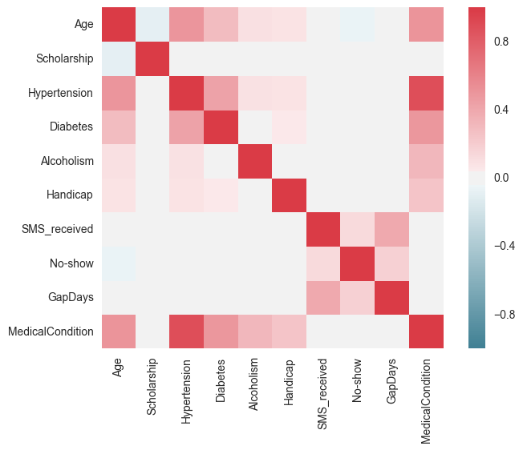


```python
correlation_matrix['No-show'].drop('No-show').sort_values(ascending = False, inplace = False)
```


    GapDays             0.186320
    SMS_received        0.126502
    Scholarship         0.029166
    Alcoholism         -0.000181
    Handicap           -0.008017
    Diabetes           -0.015158
    MedicalCondition   -0.032401
    Hypertension       -0.035662
    Age                -0.060320
    Name: No-show, dtype: float64


### Exploration of the factors that may affect no-show rate

**Exploration of Factor 1 :** Age


```python
# Plot the age distribution graph
sns.distplot(appointment_data['Age'], kde=False)
plt.title('Age distribution in the entire dataset')
plt.show()

print 'Overall Age Distribution statistics :'
appointment_data['Age'].describe()
```


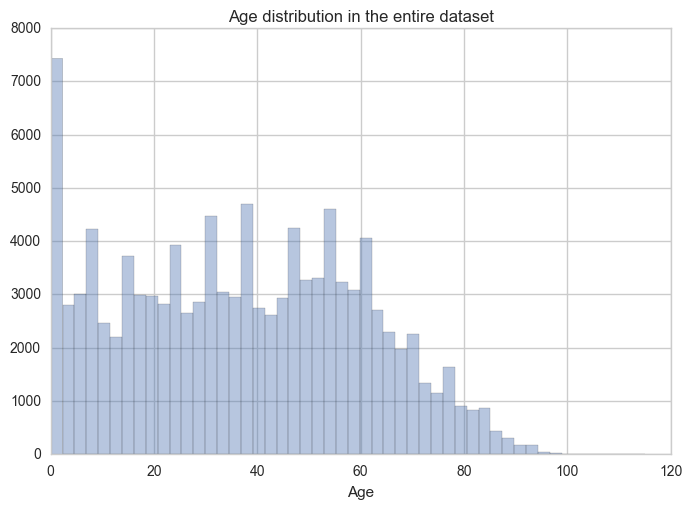


    Overall Age Distribution statistics :
    


    count    110521.000000
    mean         37.089386
    std          23.109885
    min           0.000000
    25%          18.000000
    50%          37.000000
    75%          55.000000
    max         115.000000
    Name: Age, dtype: float64


```python
# Plot the no-show v/s age graphs
age_noshow_data = appointment_data.groupby('Age')['No-show'].mean() * 100

# Joint plot
grid = sns.jointplot(y=age_noshow_data, x=age_noshow_data.index)
plt.suptitle('Plot of No-show rate v/s Age', y=1)
grid.ax_joint.set_xlabel('Age')
grid.ax_joint.set_ylabel('No-show rate (in %)')

# Bar Plot
plt.figure(figsize=(20,10)) 
ax = sns.barplot(x=age_noshow_data.index, y = age_noshow_data.values)
ax.set_xticklabels(ax.get_xticklabels(), rotation=90)
plt.tight_layout()
ax.set(title = 'No-show rate v/s Age', xlabel='Age', ylabel='No-show rate (in %)')
plt.show()

# Show statistics for the above
print 'Statistics of the no-show rate distribution across ages'
print age_noshow_data.describe()
```


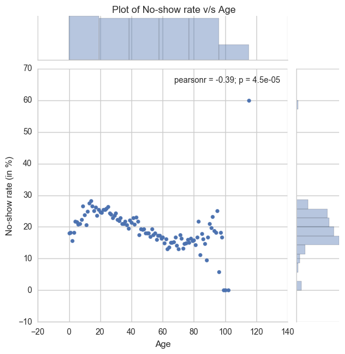


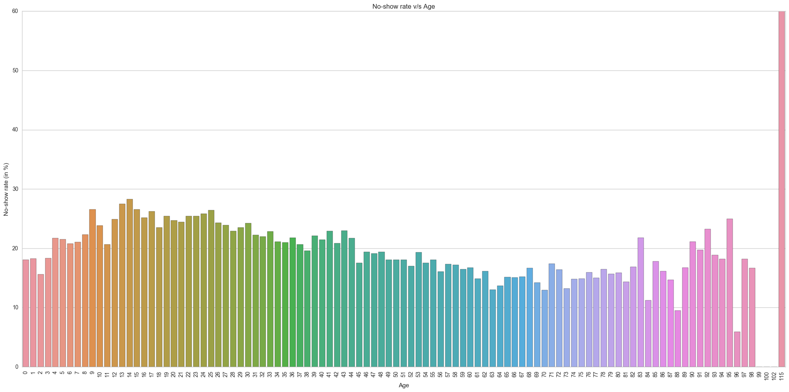


    Statistics of the no-show rate distribution across ages
    count    103.000000
    mean      19.268425
    std        6.703958
    min        0.000000
    25%       16.156191
    50%       18.867925
    75%       22.858630
    max       60.000000
    Name: No-show, dtype: float64
    

**Observations for the 'Age' factor** : 
- Overall, the distribution of age-groups in the data-set is positively skewed. In other words, there is less data available in the data-set for the higher age groups(70+), which is expected.
- There seems to be a relatively higher rate of no-show between the ages of 12-25.
- Also, in the higher age groups (90+) it seems that there is again an increase of no-show. However, there are relatively very few records in this age group (which is expected).
- The lowest no-show rates are in the group of 60-80 year olds.

**Exploration of Factor 2 :** Gender


```python
# Plot the Gender distribution graph
sns.countplot(appointment_data['Gender'])
plt.title('Gender distribution in the entire data-set')
plt.show()

appointment_data.groupby('Gender').count()
```


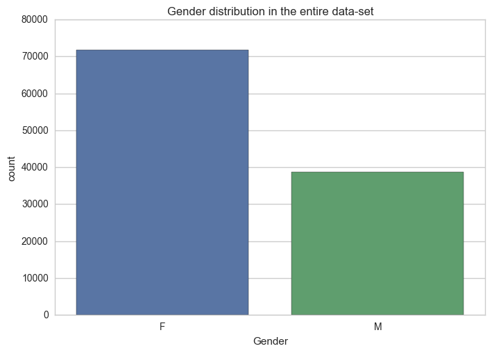


<div>
<table border="1" class="dataframe">
  <thead>
    <tr style="text-align: right;">
      <th></th>
      <th>PatientID</th>
      <th>AppointmentID</th>
      <th>ScheduledDay</th>
      <th>AppointmentDay</th>
      <th>Age</th>
      <th>Neighbourhood</th>
      <th>Scholarship</th>
      <th>Hypertension</th>
      <th>Diabetes</th>
      <th>Alcoholism</th>
      <th>Handicap</th>
      <th>SMS_received</th>
      <th>No-show</th>
      <th>GapDays</th>
      <th>MedicalCondition</th>
    </tr>
    <tr>
      <th>Gender</th>
      <th></th>
      <th></th>
      <th></th>
      <th></th>
      <th></th>
      <th></th>
      <th></th>
      <th></th>
      <th></th>
      <th></th>
      <th></th>
      <th></th>
      <th></th>
      <th></th>
      <th></th>
    </tr>
  </thead>
  <tbody>
    <tr>
      <th>F</th>
      <td>71836</td>
      <td>71836</td>
      <td>71836</td>
      <td>71836</td>
      <td>71836</td>
      <td>71836</td>
      <td>71836</td>
      <td>71836</td>
      <td>71836</td>
      <td>71836</td>
      <td>71836</td>
      <td>71836</td>
      <td>71836</td>
      <td>71836</td>
      <td>71836</td>
    </tr>
    <tr>
      <th>M</th>
      <td>38685</td>
      <td>38685</td>
      <td>38685</td>
      <td>38685</td>
      <td>38685</td>
      <td>38685</td>
      <td>38685</td>
      <td>38685</td>
      <td>38685</td>
      <td>38685</td>
      <td>38685</td>
      <td>38685</td>
      <td>38685</td>
      <td>38685</td>
      <td>38685</td>
    </tr>
  </tbody>
</table>
</div>


```python
# Plot the no-show v/s Gender graph
gender_noshow_data = appointment_data.groupby('Gender')['No-show'].mean() * 100.0
ax = sns.barplot(x=gender_noshow_data.index, y = gender_noshow_data)
ax.set(title = 'No-show rate v/s Gender', xlabel='Gender', ylabel='No-show rate (in %)')
plt.show()

# Show statistics for the above
print 'Statistics of the no-show rate distribution across Genders'
print gender_noshow_data.describe()
```


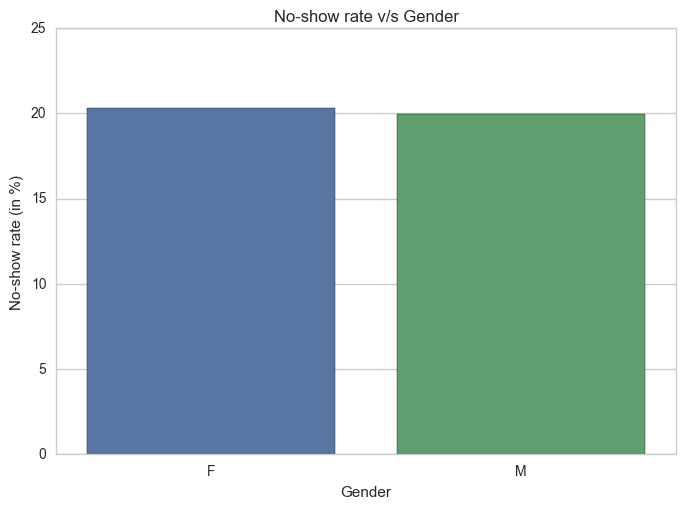


    Statistics of the no-show rate distribution across Genders
    count     2.000000
    mean     20.137677
    std       0.245884
    min      19.963810
    25%      20.050743
    50%      20.137677
    75%      20.224610
    max      20.311543
    Name: No-show, dtype: float64
    

**Observations for the 'Gender' factor** : 
- Overall, there are 1.85 times more female applicants than male applicants, which is quite surprising.
- There doesn't seem to be much of a difference in the no-show rate with respect to gender (less than half a percent).

**Exploration of Factor 3 :** Neighbourhood location


```python
# Plot the Neighbourhood distribution graph
plt.figure(figsize=(20,10)) 
ax = sns.countplot(appointment_data['Neighbourhood'])
ax.set_xticklabels(ax.get_xticklabels(), rotation=90)
plt.tight_layout()
plt.title('Neighbourhood distribution in the entire data-set')
plt.show()
```


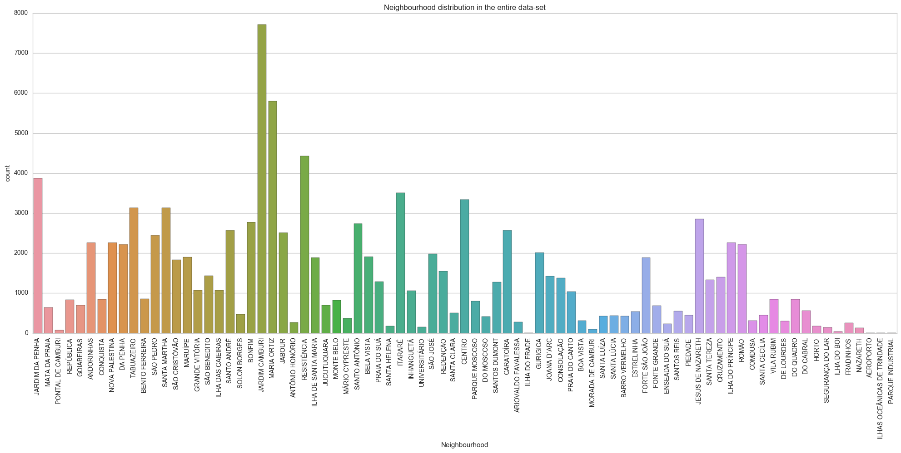


```python
# Plot the No-show v/s Neighbourhood graph

neighbourhood_noshow_data = appointment_data.groupby('Neighbourhood')['No-show'].mean() * 100.0
# Filter the neighbourhood outliers: the no. of appointments coming from there should be at least 100
neighbourhood_noshow_data = neighbourhood_noshow_data[appointment_data.groupby('Neighbourhood')['No-show'].sum() >= 100]
plt.figure(figsize=(20,10)) 
ax = sns.barplot(x=neighbourhood_noshow_data.index, y = neighbourhood_noshow_data.values, orient = 'v')
ax.set_xticklabels(ax.get_xticklabels(), rotation=90)
plt.tight_layout()
ax.set(title = 'No-show rate in different Neighbourhood locations (min. 100 appointments)', xlabel='Neighbourhood Location', ylabel='No-show rate (in %)')
plt.show()

# Show statistics for the above
print 'Statistics of the no-show rate distribution across Neighbourhood locations (min. 100 appointments)'
print neighbourhood_noshow_data.describe()
```


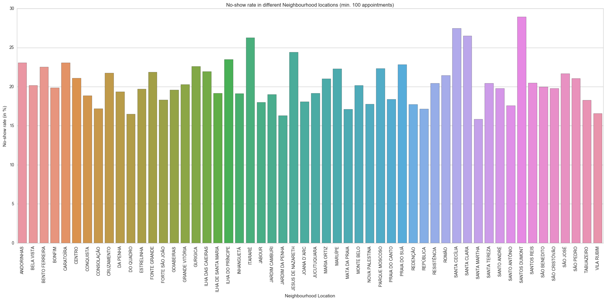


    Statistics of the no-show rate distribution across Neighbourhood locations (min. 100 appointments)
    count    54.000000
    mean     20.424881
    std       2.831800
    min      15.841584
    25%      18.326799
    50%      20.040373
    75%      21.918459
    max      28.918495
    Name: No-show, dtype: float64
    

**Observations for the 'Neighbourhood' factor** : 
- Overall, there is a big variation in the appointment applications from different neighbourhoods. The majority of applications come from places like Jardim Camburi, Maria Ortiz, and Resistência. At the same time, there are a lot of neighbourhoods from where very few people apply for appointments.
- In the no-show distribution in different neighbourhoods, there are only 2 records for 'ILHAS OCEÂNICAS DE TRINDADE' and both are no-show. Hence, the percentage is abnormally high (i.e. as much as 100%). Hence, outlier neighbourhoods have been filtered (with minimum no. of appointments set to 100) before plotting the graph.
- Essentially, some neighbourhoods seem to have a much larger no-show rate than average. A possible reason could be that these regions are farther away from the hospital, making it more difficult for patients to reach there.

**Exploration of Factor 4 :** Scholarship


```python
# Plot the Scholarship distribution graph
ax = sns.countplot(appointment_data['Scholarship'])
ax.set_xticklabels(ax.get_xticklabels())
plt.tight_layout()
plt.title('No. of scholarships in the entire data-set')
plt.show()
```


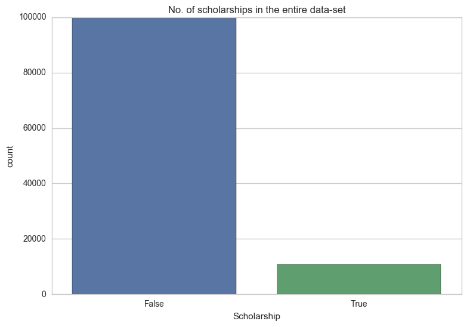


```python
# Plot the No show rate v/s Scholarship graph

scholarship_noshow_data = appointment_data.groupby('Scholarship')['No-show'].mean() * 100.0
ax = sns.barplot(x=scholarship_noshow_data.index, y = scholarship_noshow_data.values, orient = 'v')
ax.set_xticklabels(ax.get_xticklabels())
plt.tight_layout()
ax.set(title = 'No-show rate for scholarships', xlabel='Scholarship', ylabel='No-show rate (in %)')
plt.show()

# Show statistics for the above
print 'Statistics of the no-show rate distribution for scholarships'
print scholarship_noshow_data.describe()
```


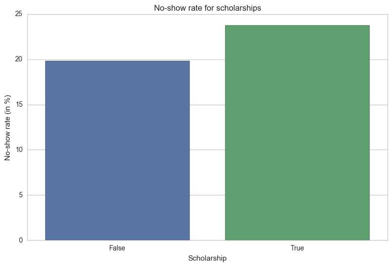


    Statistics of the no-show rate distribution for scholarships
    count     2.000000
    mean     21.769818
    std       2.781032
    min      19.803331
    25%      20.786575
    50%      21.769818
    75%      22.753061
    max      23.736304
    Name: No-show, dtype: float64
    

**Observations for the 'Scholarship' factor** : 
- Overall, there are 10 times as many patients who haven't got a scholarship compared to those who have. This seems to be normal.
- In the no-show distribution, surprisingly, people who have a scholarship have a higher no-show rate than those who don't (23.74% vs 19.8%).

**Exploration of Factor 5 :** SMS received by patients


```python
# Plot the SMS received distribution graph
ax = sns.countplot(appointment_data['SMS_received'])
ax.set_xticklabels(ax.get_xticklabels())
plt.tight_layout()
plt.title('Count of patients receiving SMS in the entire data-set')
plt.show()
```


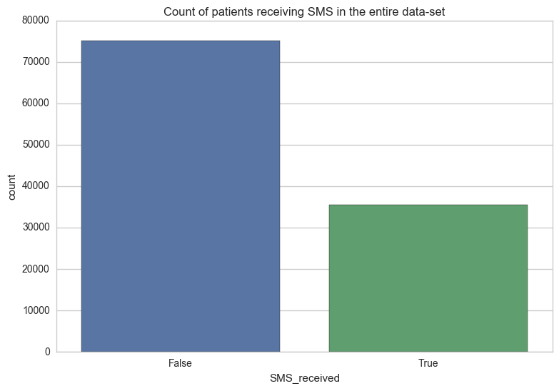


```python
# Plot the No-show rate v/s SMS received graph

sms_noshow_data = appointment_data.groupby('SMS_received')['No-show'].mean() * 100.0
ax = sns.barplot(x=sms_noshow_data.index, y = sms_noshow_data.values, orient = 'v')
ax.set_xticklabels(ax.get_xticklabels())
plt.tight_layout()
ax.set(title = 'No-show rate for SMS receipts', xlabel='SMS Received', ylabel='No-show rate (in %)')
plt.show()

# Show statistics for the above
print 'Statistics of the no-show rate distribution for SMS receipts'
print sms_noshow_data.describe()
```


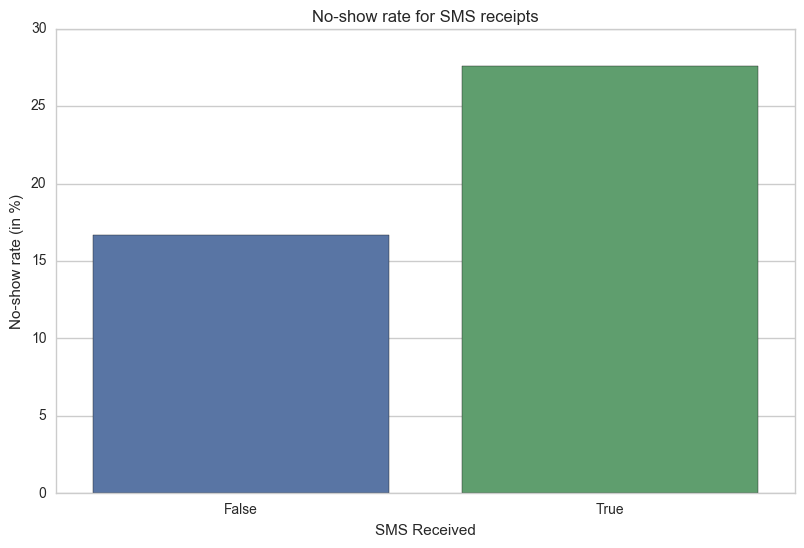


    Statistics of the no-show rate distribution for SMS receipts
    count     2.000000
    mean     22.136264
    std       7.690890
    min      16.697984
    25%      19.417124
    50%      22.136264
    75%      24.855405
    max      27.574545
    Name: No-show, dtype: float64
    

**Observations for the 'SMS Received' factor** : 
- Overall, there are twice as many patients who haven't received an SMS compared to those who have.
- Very surprisingly, sending an SMS doesn't seem to influence patients to show up for the appointment. In fact, no-show rates are much higher when patients receive SMS (27.6% vs 16.7%).

**Exploration of Factor 6 :** Gaps in days between Appointment Day and Scheduled Day


```python
# Plot the Gap days distribution graph
sns.distplot(appointment_data['GapDays'], kde=False)
plt.title('Gap days distribution in the entire dataset')
plt.show()

print 'Overall Gap Days distribution statistics'
appointment_data['GapDays'].describe()
```


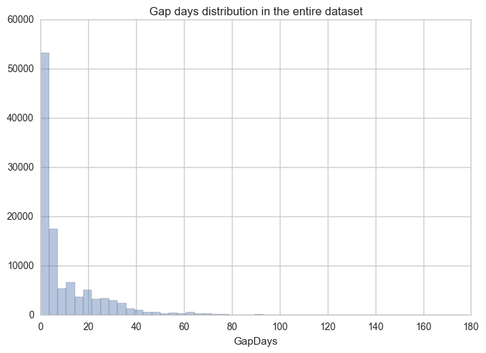


    Overall Gap Days distribution statistics
    


    count    110521.000000
    mean         10.184345
    std          15.255153
    min           0.000000
    25%           0.000000
    50%           4.000000
    75%          15.000000
    max         179.000000
    Name: GapDays, dtype: float64


```python
# Plot the No-show rate v/s Gap Days graph

gapdays_noshow_data = appointment_data.groupby('GapDays')['No-show'].mean() * 100.0

# Joint plot
grid = sns.jointplot(y=gapdays_noshow_data, x=gapdays_noshow_data.index)
plt.suptitle('Plot of No-show rate v/s no. of Gap Days', y=1)
grid.ax_joint.set_xlabel('No. of Gap Days')
grid.ax_joint.set_ylabel('No-show rate (in %)')

# Bar Plot with filtered data (no. of applications >= 10 for that gap day)
filtered_gapdays_noshow_data = gapdays_noshow_data[appointment_data.groupby('GapDays')['No-show'].sum() >= 10]
plt.figure(figsize=(20,10)) 
ax = sns.barplot(x=filtered_gapdays_noshow_data.index, y = filtered_gapdays_noshow_data.values)
ax.set_xticklabels(ax.get_xticklabels(), rotation=90)
plt.tight_layout()
ax.set(title = 'No-show rate v/s Gap Days (min. 10 applications)', xlabel='Gap Days', ylabel='No-show rate (in %)')
plt.show()

# Show statistics for the above
print 'Statistics of the no-show rate distribution for Gap Days (min. 10 applications)'
print filtered_gapdays_noshow_data.describe()
```


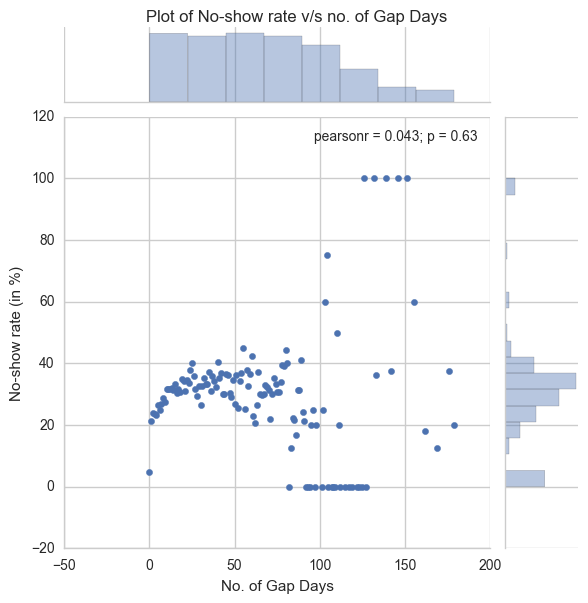


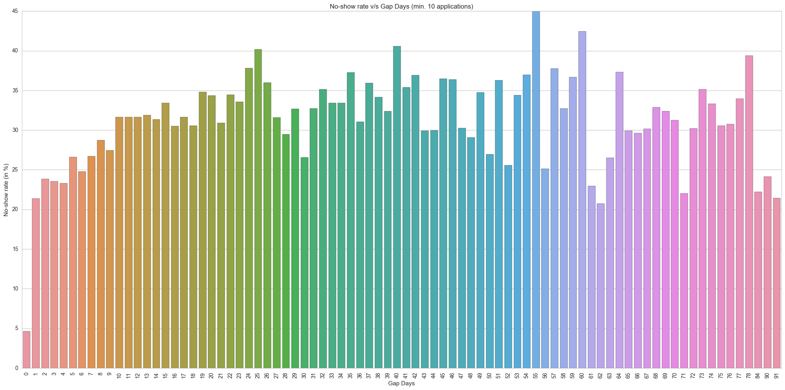


    Statistics of the no-show rate distribution for Gap Days (min. 10 applications)
    count    82.000000
    mean     31.209141
    std       5.893434
    min       4.647062
    25%      28.812985
    50%      31.624451
    75%      34.758142
    max      44.954128
    Name: No-show, dtype: float64
    

**Observations for the 'Gap Days' factor** : 
- The overall distribution of Gap Days in the data-set is positively skewed. It ranges from 0 to 179 days.
- The no-show rate is lowest when the gap days is 0, i.e. when appointment day is same as scheduled day.
- When there is a greater gap, the no-show rate tends to increase.

**Exploration of Factor 7 :** Medical condition


```python
# Plot the Medical Condition distribution graph
ax = sns.countplot(appointment_data['MedicalCondition'])
ax.set_xticklabels(ax.get_xticklabels())
plt.tight_layout()
plt.title('Count of patients suffering from a medical condition in the entire data-set')
plt.show()
```


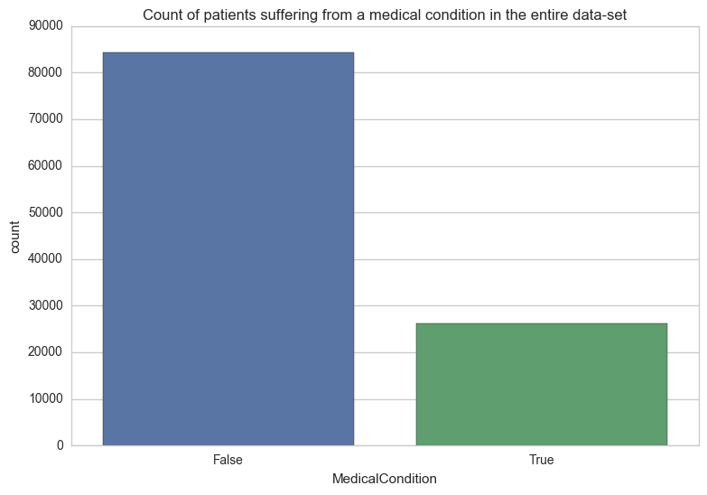


```python
# Plot the No-show rate v/s Medical Condition graph

medcond_noshow_data = appointment_data.groupby('MedicalCondition')['No-show'].mean() * 100.0
ax = sns.barplot(x=medcond_noshow_data.index, y = medcond_noshow_data.values, orient = 'v')
ax.set_xticklabels(ax.get_xticklabels())
plt.tight_layout()
ax.set(title = 'No-show rate for Medical Conditions', xlabel='Medical Condition', ylabel='No-show rate (in %)')
plt.show()

# Show statistics for the above
print 'Statistics of the no-show rate distribution for Medical Conditions'
print medcond_noshow_data.describe()
```


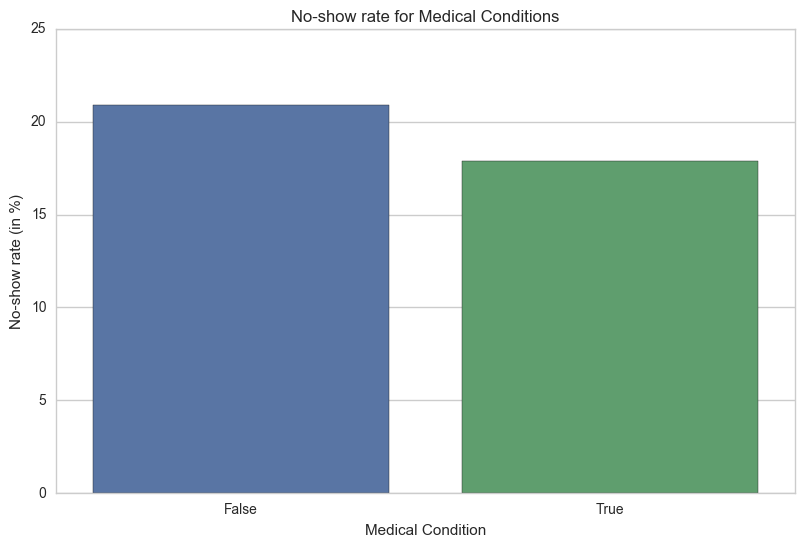


    Statistics of the no-show rate distribution for Medical Conditions
    count     2.000000
    mean     19.389543
    std       2.159651
    min      17.862439
    25%      18.625991
    50%      19.389543
    75%      20.153095
    max      20.916647
    Name: No-show, dtype: float64
    

**Observations for the 'Medical Condition' factor** : 
- Overall, there are thrice as many patients who don't seem to have any medical condition compared to those who have.
- There is only a 3% increase in no-show rates when patients do not suffer from any of the medical conditions.

### Exploration of how aging affects medical problems


```python
medcond_age_data = appointment_data.groupby('Age')['MedicalCondition'].mean() * 100.0
# Filter outliers : ignore ages having appointment count of at least 10
medcond_age_data = medcond_age_data[appointment_data.groupby('Age')['AppointmentID'].count() >= 10]

# Joint plot
grid = sns.jointplot(y=medcond_age_data, x=medcond_age_data.index, kind = 'reg')
plt.suptitle('Plot of No-show rate v/s no. of Gap Days', y=1)
grid.ax_joint.set_xlabel('Age')
grid.ax_joint.set_ylabel('Percentage of people suffering from medical condition')
sns.plt.ylim(0, 100)
sns.plt.xlim(0, None)
```


    (0, 150.0)


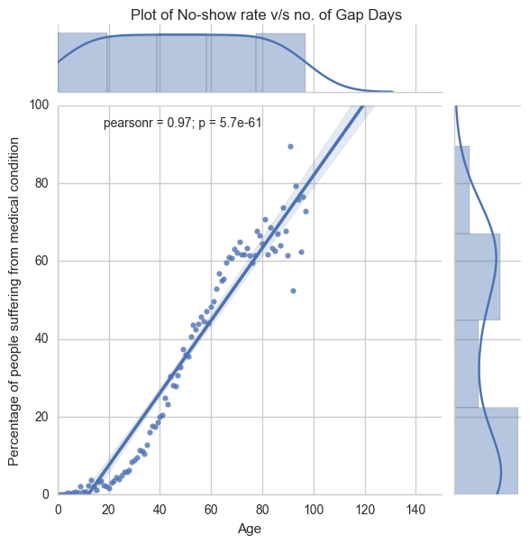


**Observation :** There is a very strong correlation between age and medical conditions (hypertension, diabetes, alcoholism and handicap).

### Exploration of the most 'unhealthy' neighbourhoods


```python
appointment_data.groupby('Neighbourhood')['AppointmentID'].count().sort_values(ascending=False).head(5)
```


    Neighbourhood
    JARDIM CAMBURI     7717
    MARIA ORTIZ        5805
    RESISTÊNCIA        4430
    JARDIM DA PENHA    3877
    ITARARÉ            3514
    Name: AppointmentID, dtype: int64


<a id='conclusions'></a>
## Conclusions

The analysis of medical appointments dataset obtained from Brazilian Hospitals has revealed some very interesting points : 

**1. Factors that can be useful for prediction of showing up for medical appointments**
- The most important factors are - **Gap Days** (interval between scheduled date and appointment date), **Age** and **Neighbourhood location**.
- **Gender** and **medical condition** of the patient do not seem to be very useful for use as factors for prediction.
- **Scholarships** and **SMS received** surprisingly appear to be counterproductive in reducing no-shows. Hospitals may consider further analysis with some controlled experiments in order to save costs on SMS.

Of course, these results are based only on correlations and this does not imply causation. There could be hidden/lurking variables in the data-set and it requires controlled experiments and hypothesis testing to conclusively prove the causations.

**2 . Proportion of men & women who register for medical appointments**

Very surprisingly, there are almost twice as many female patients compared to male patients.

**3. 'Unhealthy' neighbourhoods**

The top 5 most 'unhealthy' neighbourhoods are : Jardim Camburi, Maria Ortiz, Resistência, Jardim Da Penha, and Itararé.

**4. Correlation of aging with medical problems**

There is a very strong correlation between age and medical problems such as Diabetes, Hypertension, Alcoholism, etc.


```python

```
